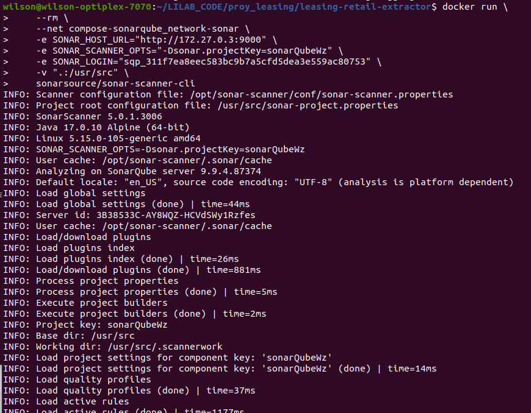
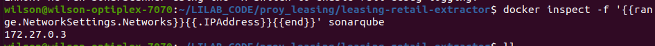
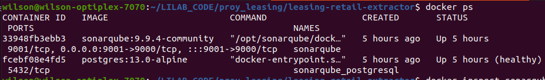

# Docker compose for SonarQube
  
  Usando sonarQube con la Base de datos Postgres

# 1) Comandos docker

  ## Levantar proyecto
    - docker-compose up -d

  ## Eliminar contenedores
    - Detener los contenedores
      `$ docker stop sonarqube sonarqube_postgresql`
    - Remover los contenedores
      `$ docker rm -v sonarqube sonarqube_postgresql`
    - listar los volumenes
      `docker volume ls`
      
       >> out:
       ```
        local     compose-sonarqube_postgresql
        local     compose-sonarqube_postgresql_data
        local     compose-sonarqube_sonarqube_conf
        local     compose-sonarqube_sonarqube_data
        local     compose-sonarqube_sonarqube_extensions
        local     compose-sonarqube_sonarqube_logs
        local     compose-sonarqube_sonarqube_temp
       ```

    - Remover los volumenes:  
      `docker volume rm compose-sonarqube_postgresql compose-sonarqube_postgresql_data compose-sonarqube_sonarqube_conf compose-sonarqube_sonarqube_data compose-sonarqube_sonarqube_extensions compose-sonarqube_sonarqube_logs compose-sonarqube_sonarqube_temp`

   ## Revisar la IP del contenedor
    - docker inspect -f '{{range.NetworkSettings.Networks}}{{.IPAddress}}{{end}}' sonarqube
  
  ---
  ## Imagenes
   - Docker run
   
   - Docker inspect
   
   - Docker ps
   
   

---
# Errores presentados

  ## (Error): max virtual memory areas vm.max_map_count [65530] is too low

    Detalle:
    ```
    ERROR: [1] bootstrap checks failed. You must address the points described in the following [1] lines before starting Elasticsearch.
    bootstrap check failure [1] of [1]: max virtual memory areas vm.max_map_count [65530] is too low, increase to at least [262144]
    ERROR: Elasticsearch did not exit normally - check the logs at /opt/sonarqube/logs/sonarqube.log

    ```

    ### SOLUCION:

    `$ sudo sysctl -w vm.max_map_count=262144`

---
# Scanear usando SonarScanner en un docker
  - Comando probado (OK):
    ```
    docker run \
      --rm \
      --net compose-sonarqube_network-sonar \
      -e SONAR_HOST_URL="http://172.27.0.3:9000" \
      -e SONAR_SCANNER_OPTS="-Dsonar.projectKey=sonarQubeWz" \
      -e SONAR_LOGIN="sqp_311f7ea8eec583bc9b7a5cfd5dea3e559ac80753" \
      -v ".:/usr/src" \
      sonarsource/sonar-scanner-cli
  
    ```


  - Comando por mejorar y probar:
  ```
  bash
  #!/bin/bash

  ## Configuración de SonarQube
  export SONAR_PROJECT_KEY="sonarQubeWz"
  export SONAR_HOST_URL="http://172.27.0.3:9000"
  export SONAR_LOGIN="sqp_311f7ea8eec583bc9b7a5cfd5dea3e559ac80753"
  export YOUR_REPO="/home/wilson/LILAB_CODE/proy_leasing/leasing-retail-extractor"

  ## imprimir variables de entorno
  echo "SONAR_PROJECT_KEY: $SONAR_PROJECT_KEY" 
  echo "SONAR_HOST_URL: $SONAR_HOST_URL" 
  echo "SONAR_LOGIN: $SONAR_LOGIN" 

  ## Correr docker 
  docker run \
    --rm \
    -v ".:/app" \
    sonarsource/sonar-scanner-cli \
    sonar-scanner \
      -Dsonar.projectKey="$SONAR_PROJECT_KEY" \
      -Dsonar.sources="." \
      -Dsonar.host.url="$SONAR_HOST_URL" \
      -Dsonar.login="$SONAR_LOGIN"
  ```